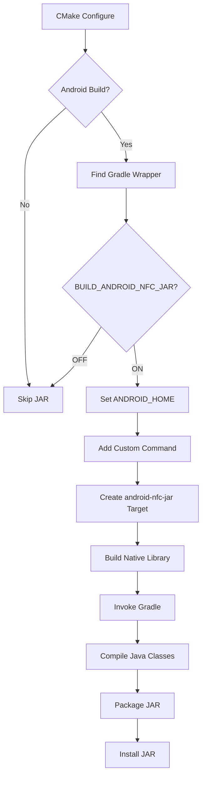

# Self-Contained JAR Implementation

## Overview

This document describes the implementation of the self-contained Android NFC JAR for keycard-qt, which eliminates the need for manual Java file copying to consumer projects.

## Problem Statement

### Before (Manual Approach)

Previously, consumers of `keycard-qt` (like status-desktop) had to:

1. **Manually copy Java source files** from keycard-qt to their project:
   ```bash
   cp keycard-qt/android/src/main/java/im/status/keycard/android/*.java \
      status-desktop/android/src/main/java/im/status/keycard/android/
   ```

2. **Keep files in sync** when updates occurred

3. **Manage duplicate source files** across repositories

**Problems:**
- ❌ Error-prone manual process
- ❌ Version synchronization issues
- ❌ Source code duplication
- ❌ No clear versioning
- ❌ Not standard Android practice

### After (JAR Approach)

Now:

1. **Automatic JAR build** during CMake compilation:
   ```bash
   # JAR built automatically when building keycard-qt
   make  # Creates android/build/libs/keycard-qt-nfc-0.1.0.jar
   ```

2. **Simple integration** - just include the JAR:
   ```cmake
   QT_ANDROID_EXTRA_LIBS += vendor/keycard-qt/android/keycard-qt-nfc-0.1.0.jar
   ```

**Benefits:**
- ✅ Automated build process
- ✅ Version-locked (JAR version matches library)
- ✅ Single source of truth
- ✅ Standard Android practice
- ✅ Self-contained library

## Implementation Details

### 1. Gradle Build Configuration

**File:** `android/build.gradle`

- Java library plugin
- Compiles Java source to .class files
- Packages into JAR with manifest
- Uses Android SDK for compilation (stubs only)
- Version matches CMakeLists.txt version

**Key Features:**
- Requires only ANDROID_HOME environment variable
- Java 11 compatibility
- Includes build metadata in manifest
- ~5KB output size

### 2. CMake Integration

**File:** `CMakeLists.txt` (lines 113-178)

Added custom build target:
```cmake
add_custom_command(
    OUTPUT ${ANDROID_NFC_JAR_OUTPUT}
    COMMAND ${GRADLE_WRAPPER} clean build
    ...
)

add_custom_target(android-nfc-jar ALL
    DEPENDS ${ANDROID_NFC_JAR_OUTPUT}
)
```

**Features:**
- Invokes Gradle during CMake build
- Sets ANDROID_HOME for Gradle
- Creates dependency chain (JAR built before library)
- Installs JAR to `${CMAKE_INSTALL_DATADIR}/keycard-qt`

**Build Options:**
- `BUILD_ANDROID_NFC_JAR=ON` - Enable JAR build (default ON for Android)
- `USE_ANDROID_NFC_BACKEND=ON` - Use Android NFC backend (default ON)

### 3. Gradle Wrapper

**Files:**
- `android/gradlew` (Unix)
- `android/gradlew.bat` (Windows)
- `android/gradle/wrapper/gradle-wrapper.jar`
- `android/gradle/wrapper/gradle-wrapper.properties`

**Purpose:**
- Self-contained Gradle distribution
- No system-wide Gradle installation required
- Version-locked (8.5)
- Cross-platform support

### 4. Java Source Files

**Files:**
- `android/src/main/java/im/status/keycard/android/KeycardNfcReader.java`

**Package:** `im.status.keycard.android`

**Classes:**
- `KeycardNfcReader` - NFC reader using Android IsoDep API

**Native Methods:**
```java
// KeycardNfcReader
private static native void onNativeTagConnected(long nativePtr, Object isoDep);
private static native void onNativeTagDisconnected(long nativePtr);
```

These are implemented in the C++ side (`keycard_channel_android_nfc.cpp`).

### 5. Installation

**JAR Install Location:**
```
${CMAKE_INSTALL_PREFIX}/share/keycard-qt/keycard-qt-nfc-${VERSION}.jar
```

Example:
```
/usr/local/share/keycard-qt/keycard-qt-nfc-0.1.0.jar
```

**Installation Component:** `android-nfc`

Can be installed separately:
```bash
cmake --install . --component android-nfc
```

## Build Process Flow



## Usage in Consumer Projects

### Step 1: Build keycard-qt

```bash
cd keycard-qt
mkdir build && cd build
cmake .. -DCMAKE_TOOLCHAIN_FILE=...
make -j10
```

Output:
- `libkeycard-qt.so` (native library)
- `android/build/libs/keycard-qt-nfc-0.1.0.jar` (Java classes)

### Step 2: Copy JAR to Consumer Project

```bash
cp keycard-qt/android/build/libs/keycard-qt-nfc-0.1.0.jar \
   status-desktop/vendor/keycard-qt/android/
```

### Step 3: Add JAR to Build Config

**Qt .pro file:**
```qmake
android {
    QT_ANDROID_EXTRA_LIBS += \
        $$PWD/vendor/keycard-qt/android/keycard-qt-nfc-0.1.0.jar
}
```

**CMake:**
```cmake
if(ANDROID)
    set_target_properties(MyApp PROPERTIES
        QT_ANDROID_EXTRA_LIBS 
        "${CMAKE_CURRENT_SOURCE_DIR}/vendor/keycard-qt/android/keycard-qt-nfc-0.1.0.jar"
    )
endif()
```

### Step 4: Build APK

Qt's build system automatically:
1. Extracts the JAR
2. Includes .class files in the APK
3. Makes classes available at runtime

## Verification

### Check JAR Contents

```bash
jar tf android/build/libs/keycard-qt-nfc-0.1.0.jar
```

Expected:
```
META-INF/
META-INF/MANIFEST.MF
im/status/keycard/android/KeycardNfcReader.class
```

### Check JAR in APK

```bash
unzip -l MyApp.apk | grep "im/status/keycard"
```

Expected:
```
im/status/keycard/android/KeycardNfcReader.class
```

### Runtime Verification

In C++ code:
```cpp
JNIEnv* env = /* get env */;
jclass cls = env->FindClass("im/status/keycard/android/KeycardNfcReader");
if (cls == nullptr) {
    // Class not found - JAR not included!
} else {
    // Success - JAR is loaded
}
```

## Troubleshooting

### JAR Not Built

**Symptom:** No JAR file after build

**Causes:**
1. `BUILD_ANDROID_NFC_JAR=OFF`
2. Gradle wrapper not found
3. ANDROID_HOME not set
4. Gradle build failed

**Solution:**
```bash
# Check CMake output
cmake .. | grep "Android NFC JAR"

# Build manually
cd android
./gradlew build --info

# Check environment
echo $ANDROID_HOME
```

### Class Not Found at Runtime

**Symptom:** `ClassNotFoundException` when app runs

**Causes:**
1. JAR not added to QT_ANDROID_EXTRA_LIBS
2. Wrong path to JAR
3. JAR not included in APK

**Solution:**
```bash
# Verify JAR path in build config
grep "keycard-qt-nfc" myapp.pro

# Check APK contents
unzip -l myapp.apk | grep keycard

# Verify class name in JNI code
# Should be: "im/status/keycard/android/KeycardNfcReader"
```

### Gradle Build Fails

**Symptom:** Gradle errors during CMake build

**Causes:**
1. ANDROID_HOME not set or wrong
2. Android platform not installed
3. Java not available
4. Network issues (first run downloads Gradle)

**Solution:**
```bash
# Set ANDROID_HOME
export ANDROID_HOME=/path/to/android-sdk

# Install Android platform
sdkmanager "platforms;android-33"

# Check Java
java -version  # Should be 11+

# Build manually to see full errors
cd android
./gradlew build --stacktrace
```

## File Structure

```
keycard-qt/
├── android/
│   ├── build.gradle                    # Gradle build config
│   ├── settings.gradle                 # Gradle settings
│   ├── gradlew                         # Unix Gradle wrapper
│   ├── gradlew.bat                     # Windows Gradle wrapper
│   ├── .gitignore                      # Ignore build artifacts
│   ├── gradle/
│   │   └── wrapper/
│   │       ├── gradle-wrapper.jar      # Gradle wrapper
│   │       └── gradle-wrapper.properties
│   ├── src/
│   │   └── main/
│   │       └── java/
│   │           └── im/status/keycard/android/
│   │               └── KeycardNfcReader.java
│   └── build/                          # Created during build
│       └── libs/
│           └── keycard-qt-nfc-0.1.0.jar
├── CMakeLists.txt                      # Updated for JAR build
└── docs/
    ├── ANDROID_JAR_USAGE.md            # User guide
    ├── STATUS_DESKTOP_INTEGRATION.md   # Integration guide
    └── SELF_CONTAINED_JAR_IMPLEMENTATION.md  # This file
```

## Design Decisions

### Why Gradle Instead of CMake?

**Options Considered:**
1. ✅ **Gradle** (chosen)
2. ❌ javac + jar commands in CMake
3. ❌ Qt's qmake

**Rationale:**
- Gradle is the Android standard
- Handles Android SDK paths automatically
- Better dependency management
- Cross-platform (works on all OSes)
- Gradle wrapper makes it self-contained
- Standard for Java/Android projects

### Why JAR Instead of AAR?

**Options Considered:**
1. ✅ **JAR** (chosen) - Just classes
2. ❌ **AAR** - Android ARchive with resources

**Rationale:**
- We only have Java classes, no resources
- JAR is simpler and smaller
- AAR would add unnecessary complexity
- JAR works perfectly with Qt Android builds
- JAR is more portable

### Why Build During CMake?

**Options Considered:**
1. ✅ **Build during CMake** (chosen)
2. ❌ Pre-built JAR checked into git
3. ❌ Manual build step

**Rationale:**
- Always up-to-date with source changes
- Version locked to library version
- No binary in git (cleaner)
- Automated CI/CD friendly
- Developer doesn't need to remember separate step

### Why Install to share/ Directory?

**Options Considered:**
1. ✅ **share/keycard-qt/** (chosen)
2. ❌ lib/keycard-qt/
3. ❌ include/keycard-qt/

**Rationale:**
- Follows FHS (Filesystem Hierarchy Standard)
- share/ is for architecture-independent files
- JAR is platform-independent (pure Java bytecode)
- Standard practice for data files
- Clear separation from native libraries

## Future Enhancements

### Potential Improvements

1. **Maven Repository**
   - Publish JAR to Maven Central or local repo
   - Use dependency management instead of file copying
   ```gradle
   dependencies {
       implementation 'im.status:keycard-qt-nfc:0.1.0'
   }
   ```

2. **Multi-ABI Support**
   - Currently JAR is architecture-independent (good!)
   - Could add native libs to AAR for full packaging
   ```
   keycard-qt-0.1.0.aar
   ├── classes.jar
   ├── jni/
   │   ├── arm64-v8a/libkeycard-qt.so
   │   └── armeabi-v7a/libkeycard-qt.so
   └── AndroidManifest.xml
   ```

3. **ProGuard/R8 Rules**
   - Add rules to prevent code shrinking of JNI methods
   ```
   -keep class im.status.keycard.android.** { *; }
   -keepclassmembers class * {
       native <methods>;
   }
   ```

4. **Automated Testing**
   - Add JUnit tests for Java classes
   - Mock Android APIs for testing
   - Run tests in CI

5. **API Documentation**
   - Generate Javadoc for Java classes
   - Include in documentation
   - Publish to docs site

## Comparison with Other Approaches

### React Native Approach

React Native keycard uses:
- Manual npm package with Java/Kotlin source
- Consumers add as dependency
- Source compiled in consumer project

**keycard-qt approach is similar but:**
- Pre-compiled JAR instead of source
- Smaller dependency size
- Faster consumer builds

### Status Keycard Go

The Go version doesn't have this issue:
- Go compiles to single binary
- No separate Java components needed
- But... can't use NFC APIs easily

**keycard-qt provides:**
- Native performance
- Direct NFC API access
- Clean separation of Java/C++

### Flutter Keycard Plugin

If this were a Flutter plugin:
- Would use platform channels
- JAR would be in flutter_plugin/android/libs/
- Automatic inclusion via plugin system

**keycard-qt approach:**
- More manual but more flexible
- Works with any Qt-based app
- Not tied to specific framework

## Conclusion

The self-contained JAR implementation provides:

✅ **Simplified Integration** - One JAR file instead of multiple source files
✅ **Version Control** - JAR version matches library version
✅ **Automation** - Built automatically during CMake build
✅ **Standard Practice** - Follows Android/Gradle conventions
✅ **Maintainability** - Single source of truth for Java code
✅ **Portability** - Works across all platforms

This makes keycard-qt truly self-contained for Android development, with no manual file copying required.

